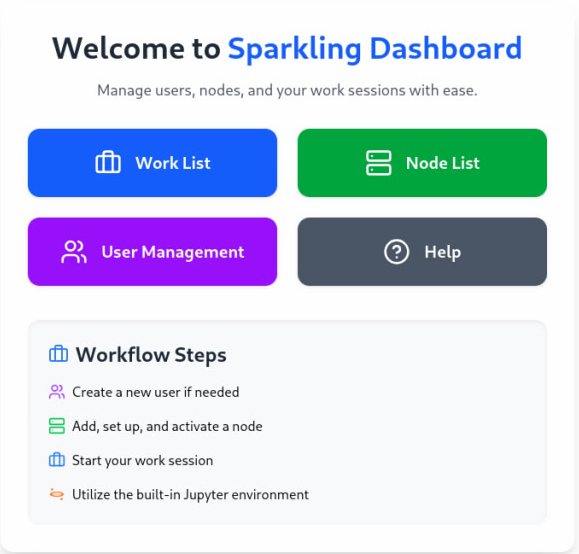

# ✨ Sparkling ✨
Sparkling is an easy-to-use Apache Spark setup and management platform. Written in Typescript and C#, its main features are as following:
*   🚀 Setup Spark nodes automatically
*   👥 Manage users working with Spark nodes
*   💰 User account balance by hours
*   📚 Jupyter notebook included
*   🐳 Powered by Docker under-the-hood



---
## 🛠️ Requirements
This software is meant for **Linux** based operating systems only! If running on **Windows**, use **WSL Ubuntu**.  
For running this project, only **Docker** and **SSH** are required. Install Docker from the official repository:
```bash
curl -fsSL https://get.docker.com | sh
```
Then, install and enable the SSH service:
```bash
sudo apt update
sudo apt install -y openssh-server
sudo systemctl enable ssh
sudo systemctl start ssh
```

Only for **development**, you would need **dotnet-9** and **node.js** installed.

---

## 🚀 Usage
Follow these steps to start the project:
*   ⬇️ **Clone** this repository
*   🛠️ **Build our docker images**, in the repository directory, run `./docker-images/build`
*   🔐 **Generate self-signed certificates**, in the repository directory, run `./sparkling-frontend/generate-ssl-certificates.sh`
*   ⬆️ **To start the program**, in the repository directory, run `docker compose up`
*   🌐 The web-based panel should now be up at `http://localhost`
*   🔑 **Login** with default admin credentials: `info@sparklean.io` and `123456Aa!@#`
*   ➕ Under node list, **add a local node** (required), then other nodes (optional)
*   ▶️ Go to work list and **start your first work**
*   📊 Click on Jupyter to **open your work session**
*   ❓ Use the help for PySpark commands
*   🗑️ When done, **delete the work** (hours will be diminished from your account if you are not admin)