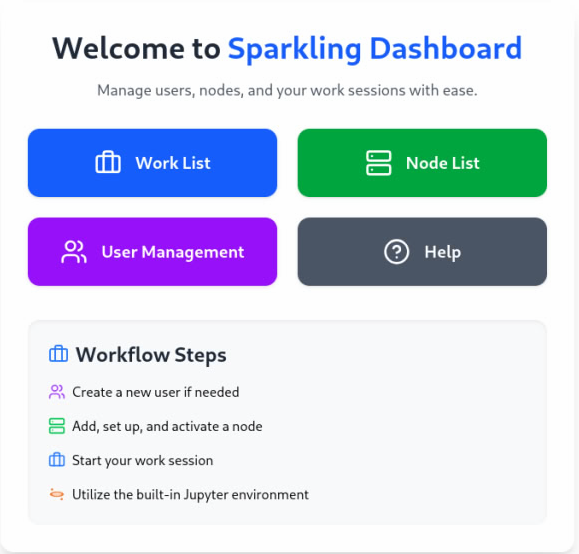

# ✨ Sparkling ✨
Sparkling is an easy-to-use Apache Spark setup and management platform. Written in Typescript and C#, its main features are as following:
*   🚀 Setup Spark nodes automatically
*   👥 Manage users working with Spark nodes
*   💰 User account balance by hours
*   📚 Jupyter notebook included
*   🐳 Powered by Docker under-the-hood



---
## 🛠️ Requirements
* **Nvidia Drivers** and **Cuda Toolkit 12.9 (or higher)** installed on all GPU-enabled systems.
* This software is meant for **Linux** based operating systems only!  
* **Docker** and **SSH** are required. Install Docker from the official repository:
```bash
curl -fsSL https://get.docker.com | sh
```
* Nvidia container toolkit must be installed using official guide at: https://docs.nvidia.com/datacenter/cloud-native/container-toolkit/latest/install-guide.html
* Finally, install and enable the SSH service:
```bash
sudo apt update
sudo apt install -y openssh-server
sudo systemctl enable ssh
sudo systemctl start ssh
```

Only for **development**, you would need **dotnet-9** and **node.js** installed.

---

## 🚀 Usage
Follow these steps to start the project:
*   ⬇️ **Clone** this repository
*   🛠️ **Build our docker images**, in the repository directory, run `./docker-images/build`
*   🔐 **Generate self-signed certificates**, in the repository directory, run `./sparkling-frontend/generate-ssl-certificates.sh`
*   ⬆️ **To start the program**, in the repository directory, run `docker compose up`
*   🌐 The web-based panel should now be up at `http://localhost`
*   🔑 **Login** with default admin credentials: `info@sparklean.io` and `123456Aa!@#`
*   ➕ Under the node list, **add a local node** (required) and any other desired nodes.
    * For each new node, click **Manage**, then **Setup Script** to download and run the script on the target node.
    * Once the setup script is complete, return to **Manage** and click **Activate**. You can now create work on your nodes.
*   ▶️ Go to work list and **start your first work**
*   📊 Click on Jupyter to **open your work session**
*   ❓ Use the help for PySpark commands
*   🗑️ When done, **delete the work** (hours will be diminished from your account if you are not admin)

## Maintating the Project
The following are notes to take into consideration for collaborating or maintaining the project:
* Python version of **spark-cuda** and **jupyter-custom** docker must be the same.

## Known Issues
* After creating a master node for the first time, if you want to create it a second time, you get an error unless you manually stop and remove the spark-master container on the master node before re-activating:
```bash
docker stop spark-master && docker rm spark-master
```

## Security Bugs
If you care to run this infrastructure in production environment, you are highly advised against doing so.  
For starters, master address is vulnerable to **remote command execution**, but you would need admin access to the panel.  
When running this software, you will have to open up your docker API on a tcp port which exposes it to whoever has localhost access, possibly causing **escalation** exploits.
If in the future I fix these bugs, I will modify this README. I may even re-write the backend with Rust as a project.